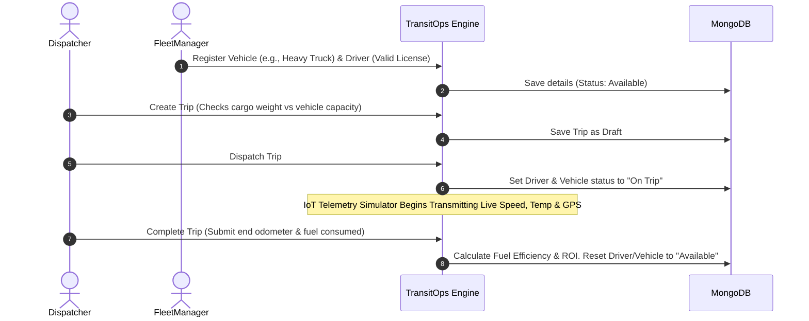

# 🚌 TransitOps — Smart Transport Operations Platform

TransitOps is a modern, enterprise-grade fleet management and smart transport operations platform built using the **MERN Stack** (MongoDB, Express, React, Node.js). 

It features an elegant pastel-designed dashboard optimized for logistics management, including **real-time simulated IoT telemetry**, **animated route trackers**, and **strict automated business logic** for vehicle dispatch, driver safety tracking, and operational expense auditing.

---

## 🎨 Design System & UI/UX
The application has been styled with a custom, custom-made **Elegant Pastel Theme** that avoids common AI-generated templates.
- **Top Navigation Bar**: An integrated top-level menu featuring responsive routes, role identification badges, and instant user profile logging.
- **Visual Grid dots Background**: Clean visual backdrop with curated CSS variable sets.
- **Illustrated Placeholders**: Custom vector illustrations designed for empty state views (empty parking spaces, empty toolbox, idle drivers, empty receipt list) to ensure a complete and premium user experience.
- **Micro-Animations**: Custom spring hover animations, floating hero illustrations, and smooth transitions on cards, buttons, and form modals.

---

## 🚀 Key Features

* **📡 Live IoT Telemetry Simulator**: Dispatched vehicles transmit real-time telemetry updates (speed, engine RPM, coolant temperature, fuel consumption rate, tire pressure, and GPS coordinates) directly to the UI.
* **📍 Animated SVG Route Tracker**: High-visibility SVG route path with a custom moving cargo truck indicator that maps transit progression in real-time.
* **🛡️ Role-Based Access Control (RBAC)**: Secure access tailored to specific organizational roles with login triggers:
  * **Fleet Manager**: Register vehicles/drivers and monitor overall fleet health.
  * **Dispatcher**: Assign routes, dispatch trips, and mark completions.
  * **Safety Officer**: Manage safety scorecards, license expirations, and safety logs.
  * **Financial Analyst**: Analyze P&L logs, operational expense sheets, and download visual analytics report exports.
* **📊 Visual Financial & ROI Reporting**: Interactive charts (via Chart.js) mapping monthly expenses, fuel efficiency analytics, and ROI matrices alongside instant CSV export capability.

---

## ⚙️ Automated Business Rules Engine
The backend enforces strict logistics business rules to prevent human errors in dispatch:
1. **Capacity Overload Check**: Automatically compares cargo weight against the vehicle's maximum registered load rating and raises warnings or blocks creation.
2. **Status Locking**: Dispatching a trip locks both the driver and the vehicle's status to `On Trip`, rendering them unavailable for any other assignments.
3. **Maintenance Lockout**: Placing a vehicle `In Shop` for maintenance excludes it from dispatch availability until the log is officially closed.
4. **License Compliance**: Highlights license expiration warnings and prevents assigning drivers with expired papers to active trips.

---

## 📊 Application Architecture & Workflow



---

## 🛠️ Project Structure
```text
├── client/          # Frontend React + Vite application
│   ├── src/
│   │   ├── assets/       # Illustrated empty states, login hero, icons
│   │   ├── components/   # Navbar, StatusBadge, EmptyState components
│   │   ├── pages/        # Dashboard, Registry, Logs, & Reports Pages
│   │   └── index.css     # Global elegant pastel variables and styling
└── server/          # Backend Node.js + Express API
    ├── models/      # Mongoose Schema Definitions
    ├── routes/      # Express API Routers
    └── seed.js      # Comprehensive realistic logistics data seeder
```

---

## 🚀 Getting Started & Setup

### Prerequisites
- **Node.js** (v18.x or higher)
- **MongoDB** (running locally on port `27017` or Atlas URL)

### 1. Backend Setup
1. Navigate to the `server/` directory:
   ```bash
   cd server
   ```
2. Setup environment variables:
   ```bash
   copy .env.example .env
   ```
   *Edit `.env` and configure your `MONGO_URI` and `JWT_SECRET`.*
3. Install dependencies:
   ```bash
   npm install
   ```
4. **Seed the database** with realistic logistics data:
   ```bash
   node seed.js
   ```
5. Start development API server:
   ```bash
   npm run dev
   ```
   *The server runs on `http://localhost:5000`.*

### 2. Frontend Setup
1. Navigate to the `client/` directory:
   ```bash
   cd ../client
   ```
2. Install dependencies:
   ```bash
   npm install
   ```
3. Start the development client:
   ```bash
   npm run dev
   ```
   *The frontend runs on `http://localhost:5173`.*

---

## 🔑 Quick Demo Login Credentials
For testing purposes, the database seeder creates standard user accounts. The password for all accounts is **`password123`**:

| Name | Role | Email Address |
| :--- | :--- | :--- |
| **Alice Smith** | Fleet Manager | `manager@transitops.com` |
| **Bob Jones** | Dispatcher | `dispatcher@transitops.com` |
| **Charlie Safety** | Safety Officer | `safety@transitops.com` |
| **Diana Penny** | Financial Analyst | `finance@transitops.com` |

---
*Created as a premium logistics hackathon project.*
